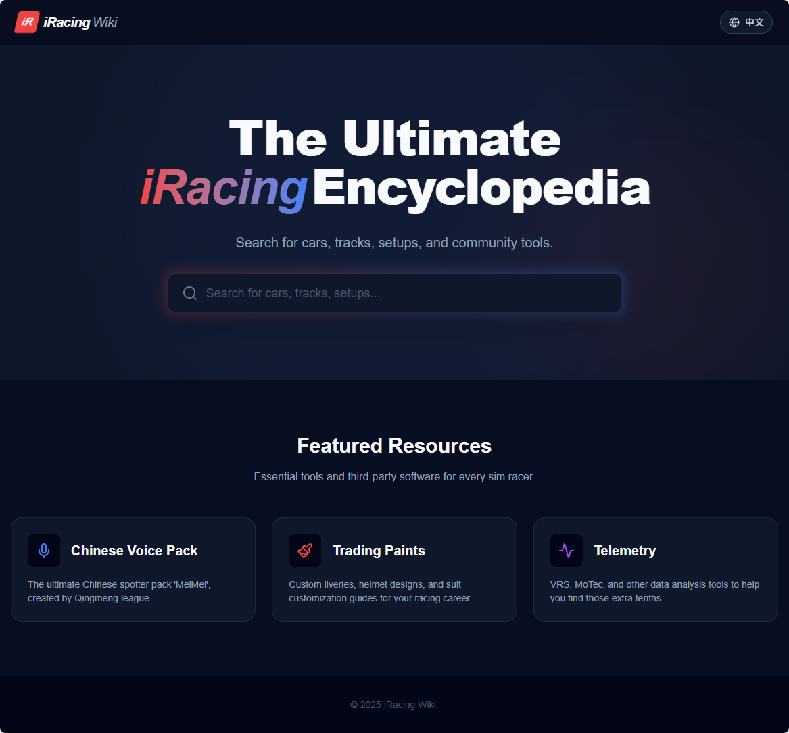

# iRacing Wiki & Community Hub 🏎️

 
*(If you have a screenshot, place it in public/screenshot.png, otherwise remove this line)*

## 🌟 Key Features

*   **🔍 Hybrid AI Search**: Combines semantic understanding (using Google Gemini Embeddings + Supabase pgvector) with traditional keyword search to find cars, tracks, and setups instantly.
*   **🌐 Bilingual Support (中/EN)**: Complete localization for the UI and content. Switch seamlesssly between Chinese and English with persistent preference storage.
*   **📚 Markdown Wiki**: Rich text rendering for wiki entries including tables, lists, and code blocks, powered by `react-markdown`.
*   **🛠️ Resource Hub**: Dedicated landing pages for essential tools like the "Qingmeng Chinese Voice Pack" and "Trading Paints".
*   **⚡ Modern UI/UX**: Built with Tailwind CSS v4 for a responsive, dark-mode-first aesthetic inspired by modern racing interfaces.
*   **🛡️ Admin Panel**: Secure, password-protected dashboard for creating and updating wiki entries (`/admin`).

## 🛠️ Tech Stack

*   **Framework**: [Next.js 15 (App Router)](https://nextjs.org/)
*   **Language**: TypeScript
*   **Styling**: [Tailwind CSS v4](https://tailwindcss.com/)
*   **Database**: [Supabase](https://supabase.com/) (PostgreSQL + pgvector extension)
*   **AI/LLM**: [Google Gemini API](https://ai.google.dev/) (`gemini-1.5-flash`) for text embeddings and embeddings generation.
*   **Icons**: [Lucide React](https://lucide.dev/)

## 🚀 Getting Started

### Prerequisites

1.  **Node.js**: v18.17 or higher.
2.  **Supabase Project**: Create a project and enable the `vector` extension.
3.  **Google AI API Key**: Get an API key from Google AI Studio.

### Installation

1.  Clone the repository:
    ```bash
    git clone https://github.com/dcdb723/iracing-wiki.git
    cd iracing-wiki
    ```

2.  Install dependencies:
    ```bash
    npm install
    ```

3.  Set up Environment Variables:
    Create a `.env.local` file in the root directory:
    ```env
    NEXT_PUBLIC_SUPABASE_URL=your_supabase_project_url
    NEXT_PUBLIC_SUPABASE_ANON_KEY=your_supabase_anon_key
    GOOGLE_GEMINI_API_KEY=your_gemini_api_key
    ```

4.  Initialize Database:
    Run the SQL scripts provided in `supabase_schema.sql` in your Supabase SQL Editor to set up tables and functions.

5.  Run Development Server:
    ```bash
    npm run dev
    ```
    Open [http://localhost:3000](http://localhost:3000) to view the app.

## 📦 Deployment

This project is optimized for deployment on **Vercel**.

1.  Push your code to a GitHub repository.
2.  Import the project in Vercel.
3.  Add the environment variables (`NEXT_PUBLIC_SUPABASE_URL`, `NEXT_PUBLIC_SUPABASE_ANON_KEY`, `GOOGLE_GEMINI_API_KEY`) in the Vercel Project Settings.
4.  Deploy!

## 📂 Project Structure

*   `/app`: Next.js App Router pages and layouts.
    *   `/wiki`: Search and Wiki Entry pages.
    *   `/resources`: Static resource pages (Voice Pack, Trading Paints).
    *   `/admin`: CMS for managing content.
    *   `/api`: Server-side API routes (Search, Admin actions).
*   `/components`: Reusable UI components (`WikiNav`, `WikiHeader`, etc.).
*   `/lib`: Utility functions (`supabaseClient`, `gemini`, `translations`).
*   `/context`: Global React providers (`LanguageContext`).

## 🤝 Contributing

Contributions are welcome! Please feel free to submit a Pull Request.

## 📄 License

This project is licensed under the MIT License.
